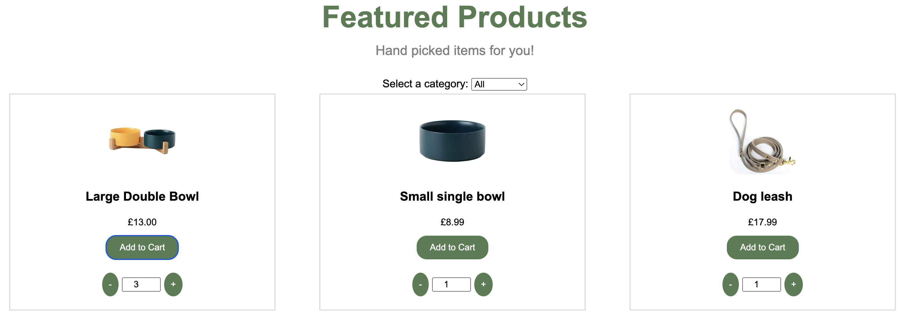
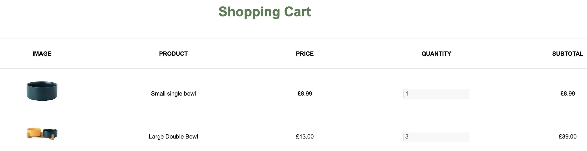

# Ecommerce Website Project

### E-commerce website for MSC Computer Science project completed in HTML, CSS and JavaScript

## Project Requirements:

- Build a single page e-commerce website using HTML, CSS and JavaScript
- Website must be uploaded to a server
- The project consist of "README" file with:
  - A link to the project
  - A short description
  - Any relevant technical details or comments
  - Anything that could be improved for a 2.0 version

## Link:

## Project Description:

This e-commerce website is a mockup for a home page of a e-petstore, as the requirement was to create a static single page website, I made sure that all the links in the header link to different section in the same page. The main page consists of the header section, featured products, that can be multiplied and added to a cart, and a cart section that displays the subtotal and total price.

## Improvements for 2,0 version:

The website can be improved through implementation of the checkout function and additional pages:

- product page
- about us/contact page
- user page (sign in & wish list)
  Further more it would be benefitial to have individual pages for each prouct with detailed descriptions.

## Website screenshots:

1. Main Page:
   

2. Featured Products:
   

3. Cart:
   
